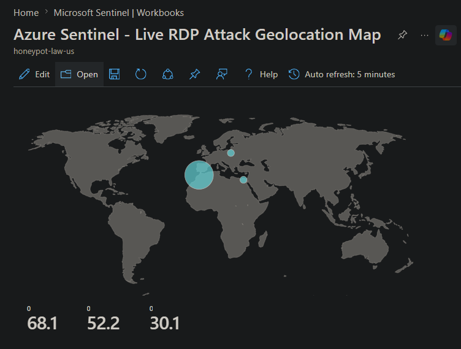
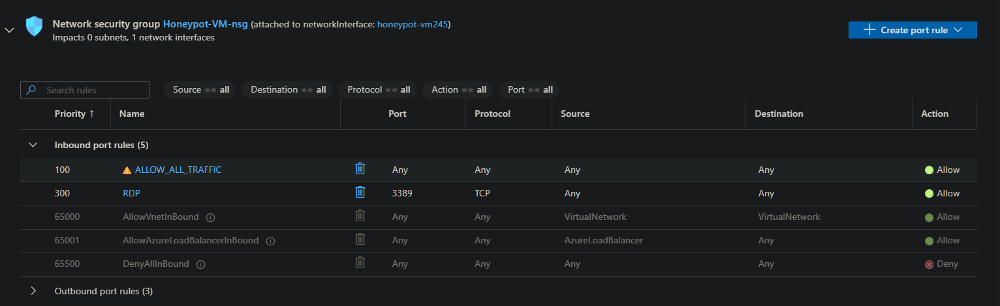
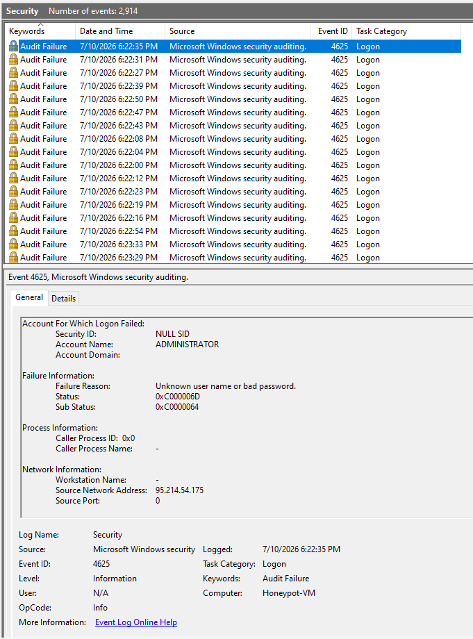
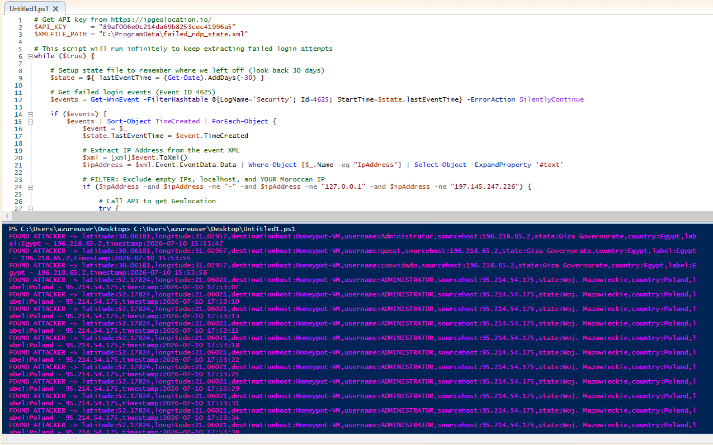
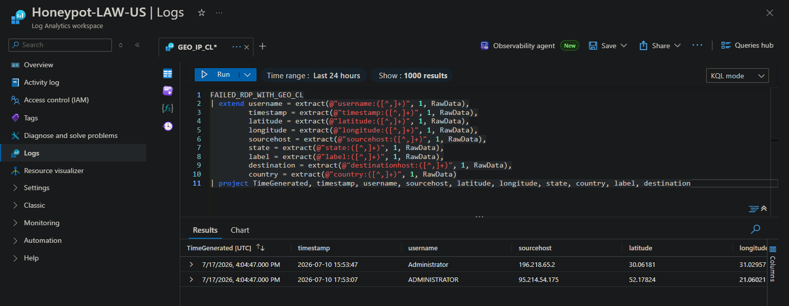

<div align="center">

# 🛡️ Azure Sentinel SIEM & Live Cyber Threat Honeypot

### Cloud-Native Threat Intelligence Lab — Global RDP Brute-Force Geo-Mapping

**Live Attack Telemetry · Geolocation-Enriched IOCs · SIEM Threat Visualization**

[](https://azure.microsoft.com)
[](https://azure.microsoft.com/products/microsoft-sentinel)
[](https://learn.microsoft.com/azure/azure-monitor/logs/log-analytics-overview)
[](https://learn.microsoft.com/azure/data-explorer/kusto/query/)
[](https://docs.microsoft.com/powershell/)
[](https://www.microsoft.com/windows-server)
[]()
[](LICENSE)

<br>



<br>

*A cloud-native honeypot & SIEM pipeline that deploys an intentionally vulnerable Windows VM on Azure, captures live RDP brute-force attacks from global threat actors, enriches attacker IPs with geolocation intelligence via REST API, ingests structured telemetry into a Log Analytics Workspace, and visualizes worldwide attack origins on a real-time Microsoft Sentinel geo-map.*

</div>

---

## 📋 Table of Contents

- [Executive Summary](#-executive-summary)
- [Architecture](#-architecture)
- [Pipeline Deep Dive](#-pipeline-deep-dive)
- [Telemetry & Results](#-telemetry--results)
- [Repository Structure](#-repository-structure)
- [Prerequisites](#-prerequisites)
- [Setup & Deployment Guide](#-setup--deployment-guide)
- [Key KQL Queries](#-key-kql-queries)
- [Lessons Learned](#-lessons-learned)
- [Roadmap](#-roadmap)
- [License](#-license)

---

## 🎯 Executive Summary

Cloud infrastructure is under siege. Within **minutes** of deploying an exposed virtual machine on any public cloud provider, automated scanners and brute-force bots begin probing for open services — with **RDP (Port 3389)** being one of the most aggressively targeted attack vectors globally. Understanding _where_ these attacks originate, _how fast_ they arrive, and _what patterns_ they follow is critical intelligence for any modern SOC (Security Operations Center).

**This lab demonstrates exactly that.**

The **Azure Sentinel SIEM & Live Cyber Threat Honeypot** is a full-stack cloud security lab that transforms a deliberately exposed Windows VM into a high-fidelity threat intelligence sensor. By pairing automated PowerShell telemetry extraction with Azure-native SIEM capabilities, this project produces a live, interactive global attack map — the same class of visualization used in enterprise SOC war rooms.

### 💡 Why This Matters

| Metric | What This Lab Proves |
|---|---|
| **Time to First Attack** | Cloud resources are targeted within **minutes** of exposure — not hours, not days |
| **Global Threat Scope** | Attacks originate from dozens of countries simultaneously — no geography is "safe" |
| **Brute-Force Velocity** | Hundreds to thousands of failed RDP login attempts accumulate within 24–48 hours |
| **SIEM Pipeline Mastery** | End-to-end telemetry pipeline: Collection → Ingestion → Parsing → Visualization |
| **SOC Analyst Skills** | Hands-on experience with Event ID 4625 analysis, KQL authoring, and Sentinel workbooks |

---

## 🏗️ Architecture

### High-Level Attack → Detection → Visualization Pipeline

```mermaid
flowchart LR
    A["🌐 Attacker\n(Internet)"] -->|"RDP Brute-Force\nPort 3389"| B["🔓 Azure NSG\n(Allow All Inbound)"]
    B -->|"Unrestricted\nAccess"| C["🖥️ Windows VM\n(Honeypot)"]
    C -->|"Event ID 4625\n(Audit Failure)"| D["📜 Security\nEvent Logs"]
    D -->|"Continuous\nPolling"| E["⚙️ PowerShell\n(Telemetry Script)"]
    E -->|"REST API Call"| F["🌍 ipgeolocation.io\n(Geo-Enrichment)"]
    F -->|"Lat, Long\nCountry, State"| G["📄 Custom Log\n(failed_rdp.log)"]
    G -->|"Custom Log\nIngestion"| H["📊 Log Analytics\nWorkspace"]
    H -->|"KQL Parsing\n& Queries"| I["🛡️ Microsoft Sentinel\n(SIEM Geo-Map)"]

    style A fill:#EF4444,stroke:#EF4444,color:#fff
    style B fill:#F59E0B,stroke:#F59E0B,color:#fff
    style C fill:#3B82F6,stroke:#3B82F6,color:#fff
    style D fill:#8B5CF6,stroke:#8B5CF6,color:#fff
    style E fill:#5391FE,stroke:#5391FE,color:#fff
    style F fill:#10B981,stroke:#10B981,color:#fff
    style G fill:#6366F1,stroke:#6366F1,color:#fff
    style H fill:#EC4899,stroke:#EC4899,color:#fff
    style I fill:#0078D4,stroke:#0078D4,color:#fff
```



### Data Flow Summary

```
Global Threat Actors (Internet)
        │
        ▼  Port 3389 (RDP)
┌─────────────────────────────────────────────────────────────┐
│  Azure Cloud Environment                                    │
│                                                             │
│  NSG (Allow *) ─► Windows VM Honeypot                      │
│                       │                                     │
│                  Event ID 4625                              │
│                  (Failed Logon)                             │
│                       │                                     │
│              PowerShell Script                              │
│              (Continuous Loop)                              │
│                  │         │                                │
│          Extract IP    Query API                            │
│                  │         │                                │
│              ipgeolocation.io                               │
│              (Lat/Long/Country)                             │
│                       │                                     │
│              failed_rdp.log                                 │
│              (Structured Output)                            │
│                       │                                     │
│          Log Analytics Workspace                            │
│          (Custom Log Ingestion)                             │
│                       │                                     │
│            KQL Query Parsing                                │
│                       │                                     │
│          Microsoft Sentinel                                 │
│          (Live Geo-Map Workbook)                            │
└─────────────────────────────────────────────────────────────┘
```

---

## 🔬 Pipeline Deep Dive

### Step 1 · 🔓 Honeypot Configuration — Intentional Vulnerability

A Windows Virtual Machine was deployed in Azure and deliberately exposed to the internet. The **Network Security Group (NSG)** inbound rule was configured to allow traffic from **any source (`*`) on any port** — with the specific intent of attracting RDP brute-force traffic on **Port 3389**.

> [!WARNING]
> This configuration is intentionally insecure and designed for lab/research purposes only. **Never** expose production workloads with permissive NSG rules.

<div align="center">

</div>

<br>

**NSG Configuration:**
| Parameter | Value |
|---|---|
| **Source** | Any (`*`) |
| **Source Port Ranges** | `*` |
| **Destination** | Any |
| **Destination Port Ranges** | `3389` (RDP) |
| **Protocol** | Any |
| **Action** | Allow |
| **Priority** | `100` (Highest) |

---

### Step 2 · 🚨 Capturing Intrusions — Windows Event ID 4625

Within minutes of deployment, automated bots and threat actors began brute-forcing the RDP service. Every failed authentication attempt was captured by Windows Security Event Logging as **Event ID 4625 (Audit Failure)** — the standard Windows event for failed logon attempts.

<div align="center">

</div>

<br>

<details>
<summary><b>📖 Event ID 4625 — Key Fields Extracted</b></summary>

| Field | Description | SOC Relevance |
|---|---|---|
| `IpAddress` | Source IP of the attacker | Primary IOC — used for geo-enrichment and blocklisting |
| `TargetUserName` | Username the attacker attempted | Reveals credential stuffing patterns (e.g., `Administrator`, `admin`, `user`) |
| `TimeCreated` | Timestamp of the failed logon | Temporal analysis — identifies attack waves and peak hours |
| `LogonType` | Type of logon attempted (Type 10 = RDP) | Confirms the attack vector is Remote Desktop Protocol |
| `Status` / `SubStatus` | Failure reason codes | Distinguishes between bad username vs. bad password attempts |

</details>

---

### Step 3 · ⚙️ Telemetry Extraction & Geo-Enrichment — PowerShell Script

The core automation engine is a custom PowerShell script ([`honeypot_script.ps1`](honeypot_script.ps1)) that runs in an **infinite loop** on the honeypot VM, continuously extracting new failed logon events and enriching them with geolocation intelligence.

**Script Capabilities:**

| Feature | Implementation |
|---|---|
| **Event Monitoring** | Polls `Security` log for Event ID `4625` using `Get-WinEvent` with stateful checkpointing |
| **State Persistence** | Uses `Export-Clixml` / `Import-Clixml` to track the last processed event timestamp — survives script restarts |
| **IP Extraction** | Parses event XML to extract `IpAddress` from `EventData` nodes |
| **Deduplication** | Checks existing log file with `-SimpleMatch` before making API calls — prevents redundant enrichment |
| **Geo-Enrichment** | Calls `ipgeolocation.io` REST API to retrieve latitude, longitude, country, and state/province |
| **Structured Output** | Writes comma-delimited telemetry to `C:\ProgramData\failed_rdp.log` in a LAW-ingestible format |
| **Safety Guard** | Validates API key is configured before execution — prevents silent failures |

<details>
<summary><b>🔧 Core Script Logic — Annotated Excerpt</b></summary>

```powershell
# Get API key from https://ipgeolocation.io/
$API_KEY      = "REPLACE_WITH_YOUR_API_KEY"
$LOGFILE_PATH = "C:\ProgramData\failed_rdp.log"
$XMLFILE_PATH = "C:\ProgramData\failed_rdp_state.xml"

# Infinite monitoring loop
while ($true) {

    # Load state (last processed event time) or default to 30 days ago
    $state = @{ lastEventTime = (Get-Date).AddDays(-30) }
    if (Test-Path $XMLFILE_PATH) {
        $state = Import-Clixml $XMLFILE_PATH
    }

    # Query Windows Security log for failed RDP logons
    $events = Get-WinEvent -FilterHashtable @{
        LogName   = 'Security'
        Id        = 4625
        StartTime = $state.lastEventTime
    } -ErrorAction SilentlyContinue

    if ($events) {
        $events | Sort-Object TimeCreated | ForEach-Object {
            $xml = [xml]$_.ToXml()
            $ipAddress = $xml.Event.EventData.Data |
                Where-Object {$_.Name -eq "IpAddress"} |
                Select-Object -ExpandProperty '#text'

            # Enrich with geolocation via REST API
            $response = Invoke-RestMethod -Uri "https://api.ipgeolocation.io/ipgeo?apiKey=$API_KEY&ip=$ipAddress"

            # Output structured telemetry line
            $logOutput = "latitude:$($response.latitude),longitude:$($response.longitude)," +
                         "destinationhost:Honeypot-VM,username:$username," +
                         "sourcehost:$ipAddress,country:$($response.country_name)," +
                         "timestamp:$($_.TimeCreated.ToString('yyyy-MM-dd HH:mm:ss'))"

            Add-Content -Path $LOGFILE_PATH -Value $logOutput -Encoding utf8
        }
        $state | Export-Clixml $XMLFILE_PATH  # Persist checkpoint
    }
    Start-Sleep -Seconds 2  # Poll interval
}
```

</details>

<div align="center">

</div>

<br>

**Sample Output Line (structured telemetry):**
```
latitude:51.5074,longitude:-0.1278,destinationhost:Honeypot-VM,username:Administrator,sourcehost:203.0.113.42,state:England,country:United Kingdom,label:United Kingdom - 203.0.113.42,timestamp:2025-07-20 14:32:17
```

---

### Step 4 · 📊 Log Ingestion & KQL Parsing — Log Analytics Workspace

The `failed_rdp.log` file generated by the PowerShell script was configured as a **Custom Log** source in an Azure Log Analytics Workspace (LAW). Once ingested, **Kusto Query Language (KQL)** was used to parse the raw comma-delimited text into structured, queryable columns.

<div align="center">

</div>

<br>

<details>
<summary><b>📝 KQL Parsing Query — Custom Log Extraction</b></summary>

```kql
FAILED_RDP_WITH_GEO_CL
| extend latitude = extract("latitude:([^,]+)", 1, RawData),
         longitude = extract("longitude:([^,]+)", 1, RawData),
         destinationhost = extract("destinationhost:([^,]+)", 1, RawData),
         username = extract("username:([^,]+)", 1, RawData),
         sourcehost = extract("sourcehost:([^,]+)", 1, RawData),
         state = extract("state:([^,]+)", 1, RawData),
         country = extract("country:([^,]+)", 1, RawData),
         label = extract("label:([^,]+)", 1, RawData),
         timestamp = extract("timestamp:([^,]+)", 1, RawData)
| where destinationhost != "samplehost"
| where sourcehost != ""
| summarize event_count = count() by sourcehost, latitude, longitude, country, label, destinationhost
| where event_count > 1
```

> This query extracts each telemetry field from the raw comma-delimited log line using KQL's `extract()` function with regex capture groups, filters out sample/test entries, and aggregates attack counts per source IP for map visualization.

</details>

**Parsed Columns:**

| Column | Type | Description |
|---|---|---|
| `latitude` | `real` | Attacker's geographic latitude |
| `longitude` | `real` | Attacker's geographic longitude |
| `sourcehost` | `string` | Attacker's IP address |
| `username` | `string` | Targeted username (e.g., `Administrator`) |
| `country` | `string` | Attacker's country of origin |
| `state` | `string` | Attacker's state/province |
| `event_count` | `long` | Aggregated number of failed attempts from this IP |
| `label` | `string` | Human-readable label (`Country - IP`) for map tooltips |

---

### Step 5 · 🗺️ Threat Visualization — Microsoft Sentinel Live Geo-Map

The final stage leverages **Microsoft Sentinel's Workbook** feature to plot the parsed geolocation coordinates on an interactive global map. Each data point represents a unique attacker IP, sized and colored by the volume of brute-force attempts — providing SOC teams with an immediate, visual threat landscape.

<div align="center">

</div>

<br>

**Workbook Configuration:**
| Setting | Value |
|---|---|
| **Visualization Type** | Map |
| **Location Info Using** | Latitude/Longitude from query |
| **Metric Label** | `label` (Country - IP) |
| **Metric Value** | `event_count` (attack volume) |
| **Size By** | `event_count` |
| **Aggregation** | Sum of events |

---

## 📈 Telemetry & Results

### Observed Attack Patterns

Deploying the honeypot and monitoring the incoming telemetry revealed several critical threat intelligence insights:

| Finding | Detail |
|---|---|
| **🕐 Time to First Attack** | Brute-force attempts began within **minutes** of VM deployment |
| **🌍 Geographic Spread** | Attacks originated from **multiple continents** simultaneously — including Eastern Europe, Southeast Asia, South America, and North America |
| **🔑 Common Usernames** | Attackers predominantly targeted `Administrator`, `admin`, `user`, and `test` — classic credential stuffing dictionaries |
| **📊 Attack Volume** | Hundreds of unique IPs generated **thousands** of failed logon attempts within the first 24–48 hours |
| **🤖 Automated vs. Manual** | The vast majority of attacks were automated bot-driven scanners, evidenced by rapid, sequential login attempts from the same IP |
| **🔄 Persistent Actors** | Several IPs returned repeatedly over multi-day windows, indicating persistent threat actors or compromised infrastructure |

---

## 📂 Repository Structure

```
Azure-SIEM-Honeypot/
│
├── 📄 README.md                       # You are here
├── 📄 honeypot_script.ps1            # Core PowerShell telemetry extraction & geo-enrichment script
│
├── 🖼️ azure-nsg-rule.png             # Screenshot: Azure NSG inbound rule configuration
├── 🖼️ event-viewer-4625.png          # Screenshot: Windows Event Viewer — Event ID 4625
├── 🖼️ powershell-live-output.png     # Screenshot: PowerShell script live execution output
├── 🖼️ kql-query-logs.png             # Screenshot: KQL query results in Log Analytics Workspace
└── 🖼️ sentinel-map.png               # Screenshot: Microsoft Sentinel live geo-map workbook
```

| File | Purpose |
|---|---|
| `honeypot_script.ps1` | Continuously monitors Event ID 4625, extracts attacker IPs, enriches via ipgeolocation.io API, and writes structured logs |
| `azure-nsg-rule.png` | Evidence of the intentionally permissive NSG inbound rule (honeypot configuration) |
| `event-viewer-4625.png` | Proof of live brute-force attack capture in Windows Security Event Logs |
| `powershell-live-output.png` | Live terminal output showing real-time attacker IP geolocation enrichment |
| `kql-query-logs.png` | Parsed and structured query results from Log Analytics Workspace |
| `sentinel-map.png` | Final Microsoft Sentinel workbook — global attack geo-map visualization |

---

## ✅ Prerequisites

Before deploying this lab, ensure you have:

| Requirement | Details |
|---|---|
| **Microsoft Azure Subscription** | Free tier or Pay-As-You-Go — [Create account](https://azure.microsoft.com/free/) |
| **Azure Virtual Machine** | Windows 10/Server VM (any size — `B1s` is sufficient) |
| **Log Analytics Workspace** | Azure Monitor resource for custom log ingestion |
| **Microsoft Sentinel** | Enabled on the Log Analytics Workspace |
| **ipgeolocation.io API Key** | Free tier (1,000 requests/day) — [Register here](https://ipgeolocation.io/) |
| **RDP Client** | To access the Windows VM for script deployment |

---

## 🚀 Setup & Deployment Guide

### Phase 1 · Azure Infrastructure

<details>
<summary><b>1. Create the Windows Virtual Machine (Honeypot)</b></summary>

1. Navigate to **Azure Portal** → **Virtual Machines** → **Create**
2. Configure:
   - **Image:** Windows 10 Pro or Windows Server 2022
   - **Size:** `Standard_B1s` (1 vCPU, 1 GiB — sufficient for honeypot)
   - **Administrator Account:** Set a username/password (this will be the brute-force target)
   - **Inbound Ports:** Allow RDP (3389)
3. Deploy the VM and note the **Public IP address**

</details>

<details>
<summary><b>2. Configure NSG — Expose the Honeypot</b></summary>

1. Navigate to the VM's **Networking** → **Network Security Group**
2. **Delete** the default RDP inbound rule (if restrictive)
3. Add a **new inbound rule:**
   - Source: `Any` | Destination: `Any` | Port: `3389` | Protocol: `Any` | Action: `Allow` | Priority: `100`
4. This makes the VM visible to the entire internet — attracting brute-force scanners

</details>

<details>
<summary><b>3. Disable Windows Firewall (On the VM)</b></summary>

1. RDP into the VM using the public IP
2. Open **Windows Defender Firewall** → **Turn Windows Defender Firewall on or off**
3. Turn **OFF** the firewall for both domain and public profiles
4. This ensures the VM responds to ICMP pings and is discoverable by scanners

</details>

### Phase 2 · Telemetry Collection

<details>
<summary><b>4. Deploy the PowerShell Script</b></summary>

1. Obtain a free API key from [ipgeolocation.io](https://ipgeolocation.io/)
2. RDP into the honeypot VM
3. Open **PowerShell ISE** as Administrator
4. Copy the contents of [`honeypot_script.ps1`](honeypot_script.ps1)
5. Replace `REPLACE_WITH_YOUR_API_KEY` with your actual API key
6. Run the script — it will begin monitoring Event ID 4625 in a continuous loop
7. Enriched attack logs will be written to `C:\ProgramData\failed_rdp.log`

</details>

### Phase 3 · SIEM Configuration

<details>
<summary><b>5. Create Log Analytics Workspace & Ingest Custom Logs</b></summary>

1. Navigate to **Azure Portal** → **Log Analytics Workspaces** → **Create**
2. Once created, go to **Tables** → **Create** → **New Custom Log (MMA-based)**
3. Upload a sample of `failed_rdp.log` from the VM
4. Set the **Custom Log Name** (e.g., `FAILED_RDP_WITH_GEO`)
5. The log will appear as `FAILED_RDP_WITH_GEO_CL` in your workspace
6. Allow **15–20 minutes** for initial data ingestion to complete

</details>

<details>
<summary><b>6. Enable Microsoft Sentinel & Build the Geo-Map Workbook</b></summary>

1. Navigate to the Log Analytics Workspace → **Microsoft Sentinel** → **Enable**
2. Go to **Workbooks** → **Add Workbook** → **Edit**
3. Add a **Query** element → paste the KQL parsing query (see [Key KQL Queries](#-key-kql-queries))
4. Set the **Visualization** to **Map**
5. Configure map settings:
   - Location info: **Latitude/Longitude**
   - Latitude: `latitude` column | Longitude: `longitude` column
   - Size by: `event_count`
6. Save the workbook — your live geo-map is now active

</details>

> [!IMPORTANT]
> **Custom log ingestion can take 15–30 minutes** to initially appear in the LAW. If KQL queries return no results immediately, wait and retry. Subsequent log updates propagate within 1–5 minutes.

---

## 🔍 Key KQL Queries

### Primary Geo-Map Query (Sentinel Workbook)

```kql
FAILED_RDP_WITH_GEO_CL
| extend latitude = extract("latitude:([^,]+)", 1, RawData),
         longitude = extract("longitude:([^,]+)", 1, RawData),
         destinationhost = extract("destinationhost:([^,]+)", 1, RawData),
         username = extract("username:([^,]+)", 1, RawData),
         sourcehost = extract("sourcehost:([^,]+)", 1, RawData),
         state = extract("state:([^,]+)", 1, RawData),
         country = extract("country:([^,]+)", 1, RawData),
         label = extract("label:([^,]+)", 1, RawData),
         timestamp = extract("timestamp:([^,]+)", 1, RawData)
| where destinationhost != "samplehost"
| where sourcehost != ""
| summarize event_count = count() by sourcehost, latitude, longitude, country, label, destinationhost
| where event_count > 1
```

### Top Attacking Countries

```kql
FAILED_RDP_WITH_GEO_CL
| extend country = extract("country:([^,]+)", 1, RawData)
| where country != ""
| summarize attack_count = count() by country
| sort by attack_count desc
| take 10
```

### Most Targeted Usernames

```kql
FAILED_RDP_WITH_GEO_CL
| extend username = extract("username:([^,]+)", 1, RawData)
| where username != ""
| summarize attempt_count = count() by username
| sort by attempt_count desc
| take 10
```

### Hourly Attack Volume (Time Series)

```kql
FAILED_RDP_WITH_GEO_CL
| extend timestamp = extract("timestamp:([^,]+)", 1, RawData)
| extend parsed_time = todatetime(timestamp)
| summarize attack_count = count() by bin(parsed_time, 1h)
| sort by parsed_time asc
| render timechart
```

---

## 💡 Lessons Learned

This lab provided practical, hands-on experience in building a **SOC (Security Operations Center)** environment from the ground up:

- **🎯 Speed of Exposure:** Cloud resources are scanned and attacked within minutes of deployment — not hours or days. This reinforces the critical importance of NSG rules, Just-in-Time (JIT) access, and the principle of least privilege.
- **🌍 Global Threat Landscape:** Brute-force attacks originate from every inhabited continent. Geographic diversity in attack sources underscores the need for global threat intelligence feeds in production SIEM deployments.
- **📊 SIEM Pipeline Architecture:** Building an end-to-end pipeline (collection → enrichment → ingestion → parsing → visualization) provided deep understanding of how enterprise SOCs operationalize raw security telemetry into actionable intelligence.
- **🔑 Credential Hygiene:** The most targeted usernames (`Administrator`, `admin`, `user`) highlight why default credential policies are a critical security control and why credential stuffing remains one of the most common attack vectors.
- **⚙️ KQL Proficiency:** Authoring custom KQL queries to parse unstructured log data into structured, visualizable columns is a core SOC analyst skill — directly applicable to any Microsoft Sentinel or Azure Monitor deployment.

---

## 🗺️ Roadmap

| Priority | Enhancement | Description |
|---|---|---|
| 🔴 High | **Automated IP Blocklisting** | Push confirmed malicious IPs back into the NSG via Azure CLI to dynamically harden the perimeter |
| 🔴 High | **Sentinel Analytics Rules** | Create automated detection rules to trigger alerts when attack volume from a single IP exceeds thresholds |
| 🟡 Medium | **Multi-Protocol Honeypot** | Expand beyond RDP — add SSH (Port 22), SMB (Port 445), and HTTP (Port 80) monitoring |
| 🟡 Medium | **Threat Intel Enrichment** | Cross-reference attacker IPs against AbuseIPDB and VirusTotal for deeper IOC context |
| 🟢 Low | **Azure Logic Apps Integration** | Auto-create ServiceNow/Jira incident tickets when high-severity attack patterns are detected |
| 🟢 Low | **Power BI Dashboard** | Build an executive-facing dashboard with attack trends, top offending countries, and temporal patterns |

---

## 📄 License

This project is licensed under the **MIT License** — see the [LICENSE](LICENSE) file for details.

---

<div align="center">

**Built with 🛡️ by a Security Engineer who wanted to see how fast the internet fights back.**

*If this lab helped you understand SIEM pipelines and cloud threat intelligence, consider giving it a ⭐*

</div>
